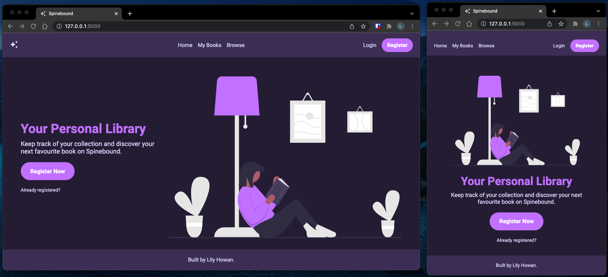

# Spinebound

## Description

Spinebound is an online book catalog which allows users to browse its database of books, view information about specific books, record their favourite books and leave reviews with a message and a rating out of 5 stars.



I developed this project as part of assignments 2 and 3 for [CS 235 (Software Development Methodologies)](https://courseoutline.auckland.ac.nz/dco/course/COMPSCI/235/1215) during Semester 2 2021. It is built using Flask, Jinja and SQLAlchemy with testing done through pytest. My grade for both assignments was A+ (100%).

## Installation

**Installation via requirements.txt**

```shell
$ py -3 -m venv .venv
$ .venv\Scripts\activate
$ pip install -r requirements.txt
```

## Execution of the web application

**Running the Flask application**

From the project directory, and within the activated virtual environment (see _venv\Scripts\activate_ above):

```shell
$ flask run
```

## Configuration

The _.env_ file contains environment variable settings - these are set with the appropriate values.

- `FLASK_APP`: Entry point of the application (should always be `wsgi.py`)
- `FLASK_ENV`: The environment in which to run the application (either `development` or `production`)
- `SECRET_KEY`: Secret key used to encrypt session data
- `TESTING`: Set to False for running the application. Overridden and set to True automatically when testing the application
- `WTF_CSRF_SECRET_KEY`: Secret key used by the WTForm library

The following settings are for the database version of the app:

- `SQLALCHEMY_DATABASE_URI`: The URI of the SQLite database, by default it will be created in the root directory of the project
- `SQLALCHEMY_ECHO`: If this flag is set to True, SQLAlchemy will print the SQL statements it uses internally to interact with the tables
- `REPOSITORY`: This flag allows us to easily switch between using the Memory repository or the SQLAlchemyDatabase repository

## Attribution and Data Sources

The image on the homepage of Spinebound was obtained from [unDraw](https://undraw.co/) under an open-source license.

The data in the excerpt files were downloaded from (Comic & Graphic):
https://sites.google.com/eng.ucsd.edu/ucsdbookgraph/home

On this webpage, you can find more books and authors in the same file format as in our excerpt, for example for different book genres.
These might be useful to extend your web application with more functionality.

We would like to acknowledge the authors of these papers for collecting the datasets by extracting them from Goodreads:

_Mengting Wan, Julian McAuley, "Item Recommendation on Monotonic Behavior Chains", in RecSys'18._

_Mengting Wan, Rishabh Misra, Ndapa Nakashole, Julian McAuley, "Fine-Grained Spoiler Detection from Large-Scale Review Corpora", in ACL'19._
